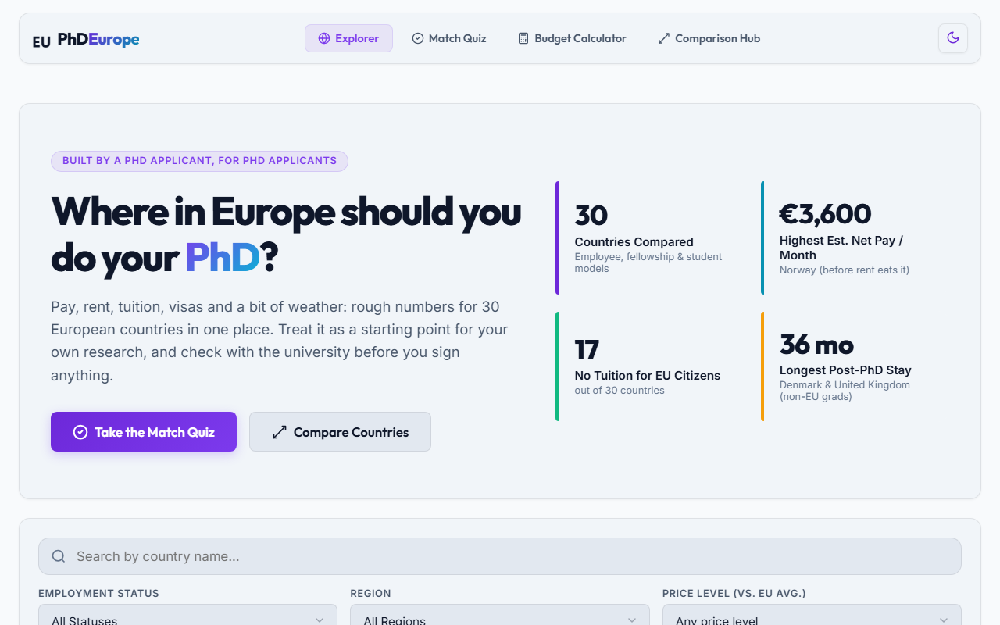

# Where in Europe should you do your PhD?

[](https://github.com/kazulak/find-country-for-phd/actions/workflows/deploy.yml)
[](LICENSE)

**Live site → [kazulak.github.io/find-country-for-phd](https://kazulak.github.io/find-country-for-phd/)**

A small static website that compares doing a PhD in **30 European countries**: pay, taxes, living costs, tuition, post-PhD visa rules and a bit of weather, all in one place, with a source link next to the numbers that matter.



## Why this exists

I'm applying for PhD positions, and I kept running into the same problem: a "PhD" in Germany, Italy and the UK are three quite different things. In one country you're an employee with a pension. In another you're a student on a tax-free stipend. In a third you might pay tuition. The facts exist, but they're scattered across ministry pages, pay-scale PDFs and forum threads.

So I collected them into one dataset and built a site around it. It's a side project, but the method is written down and the figures are cited, so you can check them yourself.

## Project status

**Feature-complete, in maintenance mode.** The site does what it set out to do; what's left is keeping the numbers current. Once a year (ideally in October) run the refresh described below and in [docs/DATA_SOURCES.md](docs/DATA_SOURCES.md). Dependabot keeps dependencies moving; merge its PRs when CI is green. Corrections via issues are always welcome.

## How this was built

This project was built with heavy use of AI coding assistants, including [Claude Code](https://claude.com/claude-code): the code, the tests, and a large share of the data research and source-finding. I set the direction and decide what goes in. Because AI can get things wrong, every pay figure, tax rate and visa rule links to the official page it came from, and the automated figures are pulled straight from Eurostat, the OECD, the ECB and the World Happiness Report by a script.

## What you can do with it

- **Explore:** a card per country with estimated net pay, living costs, tuition and post-PhD stay rights. Filter by candidate status, region and price level.
- **Take the Match Quiz:** four questions (citizenship, money priority, programme length, life outside the lab) and a transparent ranking. Every answer maps to a scoring dimension.
- **Run the Budget Calculator:** start from a country's defaults, pick a city, adjust income and expenses, and see your monthly balance.
- **Compare side by side:** up to three countries in one table.
- **Read the country pages:** one static page per country (e.g. [`/countries/germany/`](https://kazulak.github.io/find-country-for-phd/countries/germany/)), with how pay changes by year, stage or contract (e.g. Dutch salary steps, German 50–100% contracts, Polish pre/post-evaluation tiers), its sources and access dates, upsides, downsides and official portals.

The compiled dataset is also published as JSON at [`/data/countries.json`](https://kazulak.github.io/find-country-for-phd/data/countries.json) if you'd rather do your own analysis.

## Where the numbers come from

| Figure | Source | Updated |
| --- | --- | --- |
| **Pay** | Official pay tables and funder rules, one per country (e.g. TV-L E13, the Dutch university CAO, UKRI, SNSF, FCT). First-year gross, including guaranteed extras such as a 13th/14th month, plus the later steps or contract variants where pay changes (11 countries). | By hand, yearly |
| **Currency conversion** | ECB euro reference rates, annual average | Script |
| **Tax & contributions** | OECD *Taxing Wages*: income tax + employee social contributions for a single person at 67% of the average wage. Untaxed stipends subtract only documented contributions (e.g. Polish pension contributions). | Script (by hand for 2 non-OECD countries) |
| **Price level** | Eurostat price level index, EU average = 100 | Script |
| **Life satisfaction** | World Happiness Report (0–10), via Our World in Data | Script |
| **Climate** | ERA5 reanalysis via Open-Meteo: mean January/July temperature in the capital, last 10 years | Script (occasionally) |
| **Post-PhD stay** | European Migration Network comparison of national rules, plus national immigration sites | By hand |
| **Living costs** | Monthly range from the cheaper to the most expensive university city, from official university, national study-portal, EURAXESS or visa-authority budgets | By hand, every year or two |
| **Doctoral fees** | University fee pages and national portals, EU and non-EU, per year | By hand, every year or two |

The full method, the per-country source list and a step-by-step refresh checklist are in **[docs/DATA_SOURCES.md](docs/DATA_SOURCES.md)**.

**Known limitations**

- Pay varies a lot *within* a country (field, funder, contract percentage, city). One representative figure per country is a simplification; the overview text gives ranges where known.
- Net pay uses an average rate for a typical salary level, not your personal tax situation.
- Living costs are student-style budgets from official portals. An employed PhD renting their own place usually spends more.
- Fees assume a funded position: many are waived or paid by the funder. Self-funded doctorates can cost much more.
- Typical programme length and the funder lists are not sourced yet. [`reports/data_report.md`](reports/data_report.md) tracks what's missing.
- In some countries the documented pay simply doesn't cover living costs (Hungary's state scholarship, Poland's first-two-years minimum stipend). The site says so plainly.
- Language (how far you get with English alone) isn't modelled, so the site doesn't pretend to rank it.

**Always confirm the details with the university or funder before you sign anything.** If you spot something wrong, please [open an issue](https://github.com/kazulak/find-country-for-phd/issues). A correction with a source link is the most useful contribution this project can get.

## Keeping the data fresh

Once a year (ideally in October, after most pay rounds):

```bash
npm run data:refresh        # Eurostat, OECD, ECB, World Happiness Report → YAML + data/meta.yaml
npm run data:check-links    # are all cited pages still up?
# update the hand-researched pay figures (see docs/DATA_SOURCES.md), then:
npm run data:refresh        # converts the new local-currency amounts to EUR
npm run report              # what's still unsourced
npm run build && npm run test:e2e
```

## Tech

- [Astro](https://astro.build/) for static pages, with React for the two interactive widgets (budget calculator, comparison table).
- The data lives in **YAML**, one file per country, validated against a **JSON Schema** with [AJV](https://ajv.js.org/) plus consistency rules (sources present, pay conversions consistent, shortfalls explained).
- There's no backend and no tracking. Everything runs in the browser, and quiz answers never leave your device.
- Tested with **`node:test`** (data model and scoring) and **Playwright** (end-to-end, against the production build).
- Deployed to GitHub Pages by GitHub Actions. Every deploy (and every pull request) runs validation, unit tests, build verification and E2E tests first. Dependabot opens monthly update PRs for npm packages and Actions.

```text
data/countries/*.yaml      ← the canonical dataset (edit these)
data/meta.yaml             ← provenance of the automated figures (written by data:refresh)
schemas/country.schema.json
lib/country-model.js       ← YAML → site data (net pay, labels, pros/cons)
lib/score-engine.js        ← quiz scoring
scripts/                   ← validate, refresh, check links, build data, verify output, report
docs/DATA_SOURCES.md       ← method and yearly refresh guide
src/                       ← Astro pages, components and styles
tests/unit/                ← node:test unit tests
tests/e2e/                 ← Playwright tests
```

## Running it locally

Requires Node.js **22.12+**.

```bash
npm install
npm run dev          # compiles the data, then starts the dev server at http://localhost:4321/find-country-for-phd/
```

| Command | What it does |
| --- | --- |
| `npm run validate` | Schema + consistency checks for every country file. |
| `npm test` | Unit tests for the data model and scoring engine. |
| `npm run build` | Validate → test → compile data → build the site → verify `dist/`. |
| `npm run test:e2e` | Playwright tests against the built site (run `npm run build` first; first time: `npx playwright install chromium`). |
| `npm run data:refresh` | Pulls the automated figures (add `-- --dry-run` to preview, `-- --climate` to include temperatures). |
| `npm run data:check-links` | Checks every cited URL. |
| `npm run report` | Writes [`reports/data_report.md`](reports/data_report.md). |

## Contributing a correction

1. Edit the relevant file in `data/countries/` (e.g. `germany.yaml`). For pay, change `stipend.local` and add or update the source in `sources:`.
2. Run `npm run data:refresh`, `npm run validate` and `npm test`.
3. Open a pull request with a link to your source.

## License

[MIT](LICENSE) © 2026 Tomasz Kazulak. The data compiles public information from the sources cited in each country file; please check those sources' own terms if you reuse their figures in bulk.
